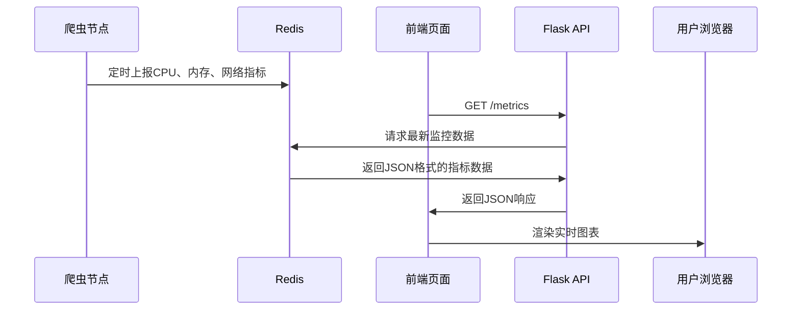

---

**以下是方案一“基于 Redis + Web API 的实时监控”的详细实施步骤**。整个方案通过扩展现有代码增加监控功能，无需额外部署服务（只需启动一个简单的 Python Web 服务）。

---

### **步骤 1：代码修改**
#### **1.1 增强 `monitors.py`**
修改 `monitors.py`，实现指标的收集和上报到 Redis：
```python
# monitors.py
import psutil
import time
import json
from redis import Redis
from twisted.internet import task  # Scrapy 基于 Twisted 框架，需用其定时器

class SpiderMonitor:
    def __init__(self, redis_host='localhost', redis_port=6379, interval=10):
        self.redis = Redis(host=redis_host, port=redis_port)
        self.monitor_key = "scrapy:node:status"  # Redis中存储监控数据的键
        self.interval = interval  # 上报间隔（秒）

    def start_monitoring(self, spider):
        """启动定时监控任务"""
        self.spider_name = spider.name
        self.timer = task.LoopingCall(self._collect_metrics)
        self.timer.start(self.interval)

    def _collect_metrics(self):
        """采集并上报指标到 Redis"""
        try:
            cpu_percent = psutil.cpu_percent()
            mem = psutil.virtual_memory().percent
            net_io = psutil.net_io_counters()
            
            metrics = {
                'timestamp': int(time.time()),
                'spider': self.spider_name,
                'cpu': cpu_percent,
                'memory': mem,
                'bytes_sent': net_io.bytes_sent,
                'bytes_recv': net_io.bytes_recv,
            }
            # 将数据序列化为JSON并保存到Redis的哈希表中
            self.redis.hset(
                self.monitor_key, 
                self.spider_name, 
                json.dumps(metrics)
            )
        except Exception as e:
            self.spider.logger.error(f'监控数据上报失败: {str(e)}')
```

---

#### **1.2 修改蜘蛛代码**
在爬虫启动和关闭时绑定监控任务（`main_spider.py`）：
```python
# main_spider.py 的 DistributedSpider 类
class DistributedSpider(RedisSpider):
    name = "main_spider"
    redis_key = "distributed:start_urls"
    test_flag = "VERSION_2.3"

    def __init__(self, *args, **kwargs):
        super().__init__(*args, **kwargs)
        # 初始化监控器
        self.monitor = SpiderMonitor(interval=10)  # 每10秒上报一次
        self.monitor.start_monitoring(self)        # 启动监控

    def spider_closed(self, reason):
        self.monitor.timer.stop()  # 关闭定时器
```

---

### **步骤 2：启动 Flask Web API**
#### **2.1 创建 `monitor_api.py` 文件**  
实现一个简单的 Web 服务，从 Redis 读取监控数据：
```python
# monitor_api.py
from flask import Flask, jsonify
import json
from redis import Redis

app = Flask(__name__)
redis_client = Redis(host='localhost', port=6379)  # 与爬虫使用相同的 Redis 配置

@app.route('/metrics', methods=['GET'])
def get_metrics():
    """获取所有爬虫节点的监控数据"""
    raw_data = redis_client.hgetall("scrapy:node:status")
    parsed_data = {}
    for spider_name, metrics_json in raw_data.items():
        spider_name = spider_name.decode('utf-8')  # Redis返回的是bytes类型，需解码
        parsed_data[spider_name] = json.loads(metrics_json.decode('utf-8'))
    return jsonify(parsed_data)

@app.route('/metrics/<spider_name>', methods=['GET'])
def get_spider_metrics(spider_name):
    """获取指定爬虫的监控数据"""
    metrics_json = redis_client.hget("scrapy:node:status", spider_name)
    if not metrics_json:
        return jsonify({"error": "Spider not found"}), 404
    return jsonify(json.loads(metrics_json.decode('utf-8')))

if __name__ == '__main__':
    app.run(host='0.0.0.0', port=5000, debug=False)
```

---

#### **2.2 安装依赖**
```bash
pip install flask
```

---

### **步骤 3：启动服务和验证**
#### **3.1 启动爬虫和 API**
```bash
# 窗口1: 启动爬虫
scrapy crawl main_spider

# 窗口2: 启动API服务
python monitor_api.py
```

#### **3.2 验证 API 数据访问**
使用浏览器或命令行测试：
```bash
# 获取所有爬虫的状态
curl http://localhost:5000/metrics

# 获取指定爬虫的状态
curl http://localhost:5000/metrics/main_spider
```

**示例响应**：
```json
{
  "main_spider": {
    "timestamp": 1717147000,
    "spider": "main_spider",
    "cpu": 12.5,
    "memory": 45.3,
    "bytes_sent": 102400,
    "bytes_recv": 409600
  }
}
```

---

### **步骤 4：可视化和告警（可选）**
#### **4.1 简单前端展示** （HTML + JavaScript）
创建一个 `dashboard.html`：
```html
<!DOCTYPE html>
<html>
<head>
    <title>Scrapy 监控面板</title>
    <script src="https://cdn.jsdelivr.net/npm/axios/dist/axios.min.js"></script>
</head>
<body>
    <h1>实时监控 - Spider节点</h1>
    <div id="metrics"></div>
    <script>
        function loadMetrics() {
            axios.get('http://localhost:5000/metrics')
                .then(response => {
                    let html = '';
                    Object.entries(response.data).forEach(([spider, data]) => {
                        html += `
                            <h3>${spider}</h3>
                            <p>CPU使用率: ${data.cpu}%</p>
                            <p>内存使用率: ${data.memory}%</p>
                            <p>网络发送: ${(data.bytes_sent / 1024).toFixed(2)} KB</p>
                            <p>网络接收: ${(data.bytes_recv / 1024).toFixed(2)} KB</p>
                        `;
                    });
                    document.getElementById('metrics').innerHTML = html;
                });
        }
        // 每5秒更新一次
        setInterval(loadMetrics, 5000);
        loadMetrics(); // 初始加载
    </script>
</body>
</html>
```

---

#### **4.2 告警规则**（Python 脚本）
编写一个简易的 CPU 过载告警脚本 `alert.py`：
```python
import time
from redis import Redis
import smtplib  # 需要配置发件邮箱

redis_client = Redis()

def check_cpu_alert(threshold=80):
    """检查CPU是否超过阈值并发送邮件"""
    data = redis_client.hgetall("scrapy:node:status")
    for spider_name, metrics in data.items():
        metrics = json.loads(metrics)
        if metrics['cpu'] > threshold:
            send_alert(spider_name, metrics['cpu'])

def send_alert(spider_name, cpu_usage):
    """发送告警邮件（需配置SMTP）"""
    message = f"Spider {spider_name} CPU使用率过高: {cpu_usage}%"
    with smtplib.SMTP('smtp.example.com', 587) as server:
        server.login('user@example.com', 'password')
        server.sendmail('alerts@example.com', 'admin@example.com', message)

if __name__ == '__main__':
    while True:
        check_cpu_alert()
        time.sleep(60)
```

---

### **核心注意点**
1. **Redis 配置一致性**  
   确保 `monitors.py` 和 `monitor_api.py` 中的 Redis 主机和端口一致（如 `localhost:6379`）。

2. **性能影响**  
   - 定时器间隔（`interval`）不宜过短（建议≥10秒），避免高频采集影响爬虫性能。  
   - 测试时需监控 Redis 内存使用，避免缓存积累。

3. **扩展性**  
   - 若有多个爬虫节点，需通过 `spider_name` 区分不同节点（如 `spider_name:ip`）。  
   - 在 API 中增加历史数据存储（如 MySQL），可通过 Redis 过期策略定期清理旧数据。

---

### **完整实施流程图**


通过此方案，你可以用不到 100 行代码实现完整的爬虫监控系统，无需依赖任何第三方服务器程序！